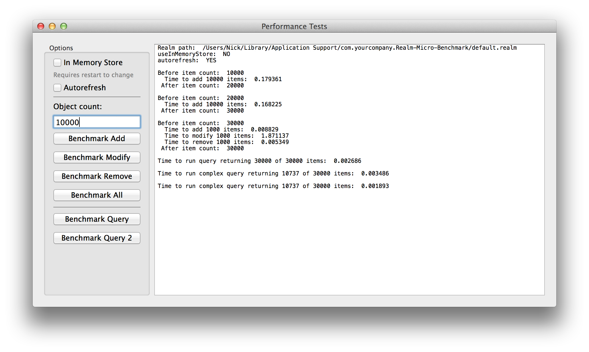

### How to set up

Requires [CocoaPods](http://cocoapods.org).  If you don’t have it, you can quickly install it with `sudo gem install cocoapods` in the Terminal.

1.  In Terminal, cd to the project folder and run `pod install`.

2.  Open the Realm Micro Benchmark.xcworkspace file (**not** the .xcodeproj file) per CocoaPods requirements.

3.  Build and run.

If using Xcode 6 and building errors out at

```objectivec
#import <Realm/Realm-Bridging-Header.h>
```

you can safely comment it out and rebuild.


### Usage

Enter a number under “Object count”.  The “Add”, “Modify”, and “Delete” buttons time how long it takes to add, modify, or delete however many items specified (or the maximum available) to the Realm.  “Benchmark All” adds that number of objects, modifies them, then deletes them in one go.  Log output is on the right.

The top checkboxes allow you to make Realm use the in-memory store (must set before the first run) and autorefresh, but neither option matters.

Query buttons time a couple of hard-coded queries.